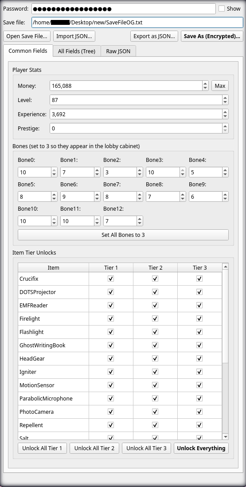
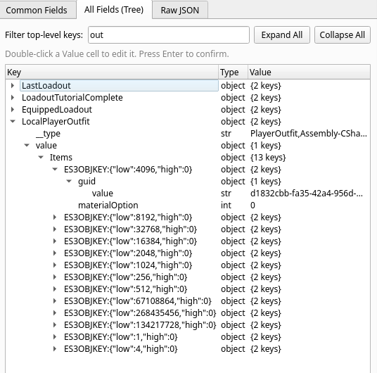
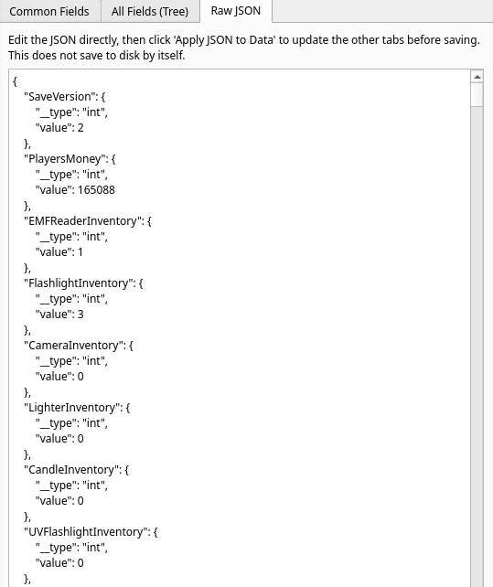

# Phasmophobia-Save-Editor
Phasmophobia save editor (includes a general-use EasySave3 library)

## Requirements

```
pip install -r requirements.txt
```

## Save File locations

On Windows, save data can be located at `%appdata%\..\LocalLow\Kinetic Games\Phasmophobia\SaveFile.txt`

On Linux (Proton), save data can be located at `~/.steam/steam/steamapps/compatdata/739630/pfx/drive_c/users/steamuser/AppData/LocalLow/Kinetic Games/Phasmophobia/SaveFile.txt`

> Desc from https://phasmoeditor.cnnd.dev/

## Example Usage for Phasmophobia Save Editor

`python3 main.py` -> `GUI Opens`

## Example Usage for ES3 Library

```python
from es3 import EasySave3, ES3Error


if __name__ == "__main__":
    es3 = EasySave3("t36gref9u84y7f43g")  # Phasmophobia default password
    
    # Load, modify, save
    data = es3.load("SaveFile.txt")
    data["PlayersMoney"]["value"] = 999999
    es3.save(data, "SaveFile_edited.txt")
    
    # Or export to JSON for manual editing
    es3.export_json(data, "SaveFile.readable.json")
    
    # Or import and encrypt from JSON
    es3.import_json("SaveFile.readable.json", "SaveFile_imported.txt")
```

I felt a little less lazy :p

---

## Note!

Common fields are only intended for use with Phasmophobia.  
Technically the GUI is compatible with other EasySave3 saves but you are limited to Tree and JSON editing.

## Pictures! <3

<table>
  <tr>
    <td align="center"><b>Common Fields</b></td>
    <td align="center"><b>Tree View</b></td>
    <td align="center"><b>Raw JSON view</b></td>
  </tr>
  <tr>
    <td></td>
    <td></td>
    <td></td>
  </tr>
</table>

> Made with <3 by Flory
